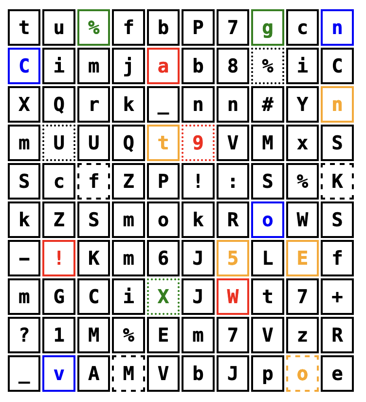

[](https://goreportcard.com/report/github.com/antfie/otp-generator)


# OTP Generator

This simple tool creates a One-Time Pad (OTP) as an HTML page. Colors and styles are introduced to aid visual reference. The style of the OTP grid can be configured by modifying the CSS either in the template or the generated file `otp.html`.

## Example

Here is an example of generating a 10x10 OTP:

```bash
go run main.go 10
```



# Credits

This tool was created by Anthony Fielding. It was inspired by this physical device [PassCard by Minute Objects](https://www.kickstarter.com/projects/minuteobjects/passcard).